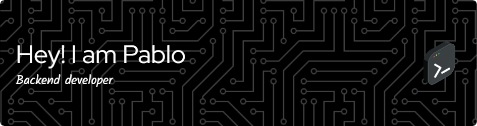

#  Welcome to my Github

##

### Things i code with: 

##

En este espacio encontrarás una colección de mis proyectos personales y colaboraciones. Estoy siempre en busca de nuevas oportunidades para aprender y crecer, así que no dudes en explorar mi trabajo y contactarme si tienes alguna pregunta o idea para colaborar.

    

